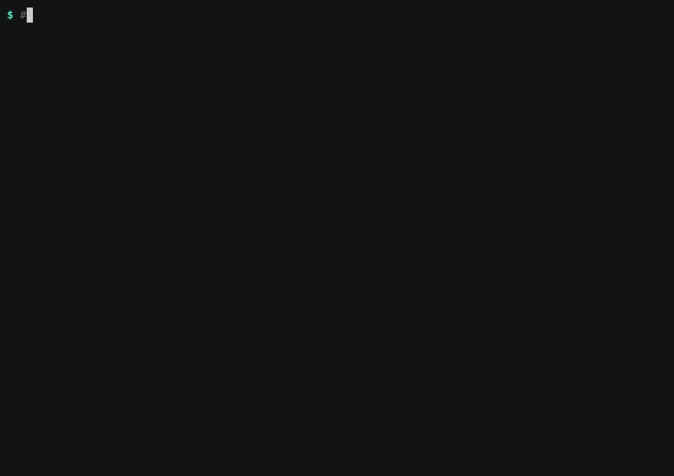

<div align="center">

# cka-helm-practice

**Four hands-on CKA exams — three on Helm, one on NetworkPolicy and network troubleshooting. You solve them against a real cluster, and the grader checks the cluster — not your answers.**

[](CHANGELOG.md)
[](LICENSE)
[](#the-four-exams)
[](#scoring)
[](#scoring)

[](https://helm.sh)
[](https://www.cncf.io/training/certification/cka/)
[](#requirements)
[](https://killercoda.com/playgrounds/scenario/cka)
[](#how-it-works)

[](https://github.com/alvarodiez20/cka-helm-practice/commits/main)
[](https://github.com/alvarodiez20/cka-helm-practice)

[Quick start](#quick-start) · [Commands](#commands) · [The four exams](#the-four-exams) · [Scoring](#scoring) · [Troubleshooting](#troubleshooting)

<!-- Recorded with demo/record-demo.sh on a Killercoda CKA playground
     (Kubernetes v1.35.1, Helm 4.1.1). See demo/README.md. -->


</div>

---

These are not theory questions. Each task is something you do to a live cluster,
and `grade` inspects the real state afterwards — release status, revision
numbers, stored values, rendered manifests, whether a chart passes `helm lint`.
Guessing does not score.

Task statements are in **English**, like the real exam. Every task has an
`explain` walkthrough that shows what to inspect first, what each flag does and
why, how to verify, and the trap that usually costs the points.

## Quick start

Open the [Killercoda CKA playground](https://killercoda.com/playgrounds/scenario/cka)
— its Kubernetes version matches the exam — and paste:

```bash
curl -sL https://raw.githubusercontent.com/alvarodiez20/cka-helm-practice/main/bootstrap.sh | bash
```

That downloads all four exams and seeds exam 1. To seed a different one:

```bash
curl -sL https://raw.githubusercontent.com/alvarodiez20/cka-helm-practice/main/bootstrap.sh | EXAM=2 bash
curl -sL https://raw.githubusercontent.com/alvarodiez20/cka-helm-practice/main/bootstrap.sh | EXAM=3 bash
curl -sL https://raw.githubusercontent.com/alvarodiez20/cka-helm-practice/main/bootstrap.sh | EXAM=4 bash
```

Or clone it:

```bash
git clone https://github.com/alvarodiez20/cka-helm-practice.git
cd cka-helm-practice && ./setup.sh
```

Then load the shell functions once — new shells pick them up automatically via
`~/.bashrc`:

```bash
source ~/cka-helm-practice/activate.sh
```

## Commands

From any directory, once `activate.sh` is loaded:

| Exam 1 | Exam 2 | Exam 3 | Exam 4 | What it does |
|---|---|---|---|---|
| `exam` | `exam2` | `exam3` | `exam4` | list every task with points and ✔/✘ status |
| `q N` | `q2 N` | `q3 N` | `q4 N` | show task N |
| `grade` | `grade2` | `grade3` | `grade4` | grade everything, print the score out of 100 |
| `grade N` | `grade2 N` | `grade3 N` | `grade4 N` | grade one task |
| `explain N` | `explain2 N` | `explain3 N` | `explain4 N` | step-by-step walkthrough, with the reasoning |
| `solve N` | `solve2 N` | `solve3 N` | `solve4 N` | just the commands, no explanation |
| `examhelp` | `exam2help` | `exam3help` | `exam4help` | full usage, including task ordering |
| `examreset` | `exam2reset` | `exam3reset` | `exam4reset` | re-seed that exam from scratch |

`q`, `grade`, `explain` and `solve` complete task numbers with **Tab**. Exam 4
adds one more: **`netcheck`**, which drives real traffic between the seeded pods
and prints what got through.

These are shell functions, not a REPL: `kubectl` and `helm` stay in the
foreground, which is where the exam is actually solved. If you would rather not
touch your shell, everything works through the scripts directly — `./exam.sh`,
`./exam.sh q 4`, `./exam2.sh explain 8`, `./exam4.sh help`.

## The four exams

They are independent, cover different ground, and can all be active on the same
cluster at once — separate chart sources, namespaces and answer directories.

Exams 1 and 2 serve their charts from `localhost` and work with no internet.
Exam 3 deliberately does not: it uses the real public charts the current CKA
asks about, so it needs egress. Exam 4 needs no Helm at all — it is pure
`kubectl`, and only needs egress to pull two container images.

### Exam 1 — the core workflow

Releases, revisions, values and packaging. Seeded by `setup.sh`.

| # | Pts | Task | Key idea |
|---|---|---|---|
| 1 | 7 | Install into a namespace that does not exist | `--create-namespace`, `--version`, `--set` |
| 2 | 8 | Recover a release broken by a bad upgrade | `helm history`, `helm rollback` |
| 3 | 6 | Find a release whose namespace is unknown | `helm list -A` |
| 4 | 7 | Upgrade without losing configured values | `--reuse-values` |
| 5 | 8 | Render manifests without installing | `helm template` |
| 6 | 7 | Dump all values, defaults included | `helm get values -a` |
| 7 | 7 | Uninstall but keep the release recoverable | `--keep-history` |
| 8 | 8 | Bring that release back from history | `helm rollback` on an uninstalled release |
| 9 | 10 | Create a chart with given chart/app versions | `helm create`, `helm lint` |
| 10 | 7 | Package a chart into a directory | `helm package -d` |
| 11 | 8 | Install a packaged chart, wait for readiness | `.tgz` install, `--wait` |
| 12 | 9 | Store an image tag as a string, not a number | `--set-string` |
| 13 | 8 | Declare and vendor a chart dependency | `helm dependency update` |

### Exam 2 — repos, values files and debugging

Seeded by `setup2.sh`.

| # | Pts | Task | Key idea |
|---|---|---|---|
| 1 | 6 | Register a chart repo and refresh the cache | `helm repo add` / `update` |
| 2 | 6 | Capture a chart's default values | `helm show values` |
| 3 | 8 | Install from a values file you author | `-f` / `--values` |
| 4 | 8 | Two values files, in the order that wins | `-f` precedence |
| 5 | 7 | Deploy with one command that is safe to re-run | `helm upgrade --install` |
| 6 | 7 | Dump what a live release actually consists of | `helm get manifest` |
| 7 | 8 | Recover the values from a past revision | `helm get values --revision` |
| 8 | 9 | Make a failing upgrade undo itself | `--atomic` |
| 9 | 10 | Fix a chart until `helm lint` passes | cascading errors, fix and re-lint |
| 10 | 7 | Render one template and nothing else | `--show-only` |
| 11 | 8 | Find the failed release, wherever it is | `helm list -A --failed` |
| 12 | 9 | Set a subchart's value from the parent | `--set <subchart>.<key>` |
| 13 | 7 | Purge a release, history included | plain `helm uninstall` |

### Exam 3 — real charts, CRDs and OCI registries

Seeded by `setup3.sh`. **Needs internet access.** Nothing is pre-configured:
registering the repositories is part of the exam, as it is in the real one.

| # | Pts | Task | Key idea |
|---|---|---|---|
| 1 | 6 | Register the Argo chart repo and cache its index | `helm repo add` / `update` |
| 2 | 9 | Render Argo CD with no CRDs in the output | `--skip-crds` does nothing here |
| 3 | 8 | Install Argo CD, keeping its CRDs out of the cluster | `--set crds.install=false` |
| 4 | 7 | Render a chart's CRDs, which are missing by default | `--include-crds` |
| 5 | 6 | Report the app version a chart version ships | `helm show chart` |
| 6 | 8 | Install from a values file you author | `-f`, nested keys |
| 7 | 8 | Install the same chart from an OCI registry | `oci://`, no repo |
| 8 | 8 | Change chart version, keep the configured values | `--reuse-values` |
| 9 | 8 | Find a release `helm list` refuses to show | `helm list -A -a`, pending-install |
| 10 | 8 | Report what Helm thinks the release consists of | `helm status --show-resources` |
| 11 | 8 | Store a nested object in one flag | `--set-json` |
| 12 | 9 | Fetch a chart from OCI, unpacked, without installing | `helm pull --untar --untardir` |
| 13 | 7 | Inventory every release, every namespace, every state | `helm list -A -a` |

Tasks 2 and 4 are the pair worth doing carefully. They look like the same
question and have opposite answers, because one chart keeps its CRDs in
`crds/` and the other keeps them in `templates/`. Getting that wrong is the
most commonly reported Helm mistake on the exam.

### Exam 4 — NetworkPolicy and network troubleshooting

Seeded by `setup4.sh`. No Helm; pure `kubectl`.

| # | Pts | Task | Key idea |
|---|---|---|---|
| 1 | 6 | Default-deny ingress for a whole namespace | `podSelector: {}`, `policyTypes` |
| 2 | 7 | Allow one pod label on one port, same namespace | bare `podSelector` in `from` |
| 3 | 8 | Allow every pod in a labelled namespace | `namespaceSelector`; you cannot name a namespace |
| 4 | 9 | Allow only pods that match a pod AND a namespace label | **the AND/OR dash trap** |
| 5 | 9 | Default-deny egress without breaking DNS | UDP *and* TCP on 53 |
| 6 | 8 | Egress to a CIDR with a hole in it | `ipBlock` + `except` |
| 7 | 8 | Allow a whole port range | `endPort` |
| 8 | 8 | Fix a policy that applies but matches nothing | label typo, no referential integrity |
| 9 | 7 | A Service with no endpoints | selector must match *pod* labels |
| 10 | 7 | A Service with endpoints that refuses connections | `port` vs `targetPort` |
| 11 | 8 | A pod that cannot resolve anything | `dnsPolicy`, and why it is immutable |
| 12 | 7 | Expose a Service on a fixed port on every node | `NodePort`, allowed range |
| 13 | 8 | Work out which policies apply to one pod | selector match **and** direction |

Task 4 is the one to slow down on. These two differ by a single dash, and one
of them allows vastly more traffic than intended:

```yaml
from:                          from:
  - namespaceSelector:           - namespaceSelector:
      matchLabels:                   matchLabels:
        tier: backend                  tier: backend
    podSelector:                 - podSelector:
      matchLabels:                   matchLabels:
        app: api                       app: api
#  ^ one element = AND         #  ^ two elements = OR
```

**A warning that matters more than any task here.** NetworkPolicy is only
enforced if your CNI implements it. Plain Flannel, and any cluster with no
policy controller, will accept every policy object and silently block nothing —
`kubectl apply` succeeds and traffic flows regardless. `setup4.sh` probes this
directly: it applies a deny-all and tries a real connection. It tells you the
answer and records it, and `netcheck` repeats the warning. Grading reads the
policy objects you wrote, so the exam still works either way — but if you want
to *see* policies bite, use Calico or Cilium.

**Order matters.** In exam 2, task 1 registers the repo that tasks 2, 3, 5, 8
and 10 install from, and task 13 destroys what task 11 asks you to find. In
exam 3, task 1 feeds 2 and 3, task 6 creates the namespace 7 and 8 use, and
task 9 must be done before 13. In exam 4, task 1's default-deny is what makes
tasks 2, 3 and 4 mean anything, and task 13 asks you to inventory policies you
created earlier — so leave it for last. `exam2help`, `exam3help` and `exam4help`
spell out the dependencies. Exam 1 has one such pair: read task 8 before you run
task 7.

## Showing it to someone else

`demo/record-demo.sh` records a scripted terminal walkthrough with
[asciinema](https://asciinema.org) and renders it to a GIF and an animated SVG:

```bash
pip install asciinema
cargo install --git https://github.com/asciinema/agg

./demo/record-demo.sh            # exam 1
EXAM=3 ./demo/record-demo.sh     # exam 3
```

It types the commands itself, so the recording is reproducible.
[demo/README.md](demo/README.md) compares the formats — GIF, SVG, asciinema
embed, MP4, screenshots — and which ones survive being posted where.

## Scoring

100 points per exam, and **66 passes** — the real CKA pass mark. Partial credit
does not exist per task: a task either satisfies every condition or scores zero,
which is also how the real exam's automated checks behave.

```
  SCORE: 74/100  (74%)   PASS
```

`exam`, `exam2`, `exam3` and `exam4` show a ✔ next to tasks that already pass, so
you can leave and come back.

## How it works

`setup.sh` and `setup2.sh` each:

1. check you have a reachable cluster, and install Helm if it is missing;
2. build a practice chart in three versions and serve it from a **local chart
   repository** on `127.0.0.1:8879` (exam 1) or `:8880` (exam 2), via
   `python3 -m http.server` — so the exams work with no internet access beyond
   the pod images;
3. seed the cluster into the state the tasks assume: a release with several
   revisions and a broken current one, a release hidden in an unobvious
   namespace, a genuinely failed release, a chart that fails `helm lint`, a
   parent chart with a vendored subchart.

`setup3.sh` works differently on purpose. There is no local repository — it
checks egress to the real chart sources, removes any repo the tasks ask you to
add, and seeds one release stuck in `pending-install` for task 9 (by starting a
real install and killing it, which is how that state happens in production).
The charts it uses:

| Alias | Source |
|---|---|
| `argo` | `https://argoproj.github.io/argo-helm` |
| `traefik` | `https://traefik.github.io/charts` |
| `ingress-nginx` | `https://kubernetes.github.io/ingress-nginx` |
| `podinfo` | `https://stefanprodan.github.io/podinfo` |
| `podinfo` (OCI) | `oci://ghcr.io/stefanprodan/charts/podinfo` |

Chart versions are pinned, and historical versions never leave a repo index, so
the tasks stay valid.

`setup4.sh` uses no Helm at all. It creates five labelled namespaces with pods
that serve and pods you can `exec` into, plants three broken Services and a
NetworkPolicy with a one-letter label typo, and then probes whether the CNI
enforces policy. Its layout is written to `~/exam4/README.txt` so you never have
to guess a label.

Answers are the cluster's own state. A few tasks want a file instead, and say so
— those live in `~/answers` … `~/answers4`. Charts and values files you author go
in `~/exam2` and `~/exam3`.

Exam 4 grades the NetworkPolicy tasks by parsing the policy objects with real
JSON rather than `grep`, because the distinctions that matter are structural: one
`from` element versus two, UDP versus TCP on port 53. An almost-right policy
scores zero. The troubleshooting tasks are graded on behaviour instead —
endpoints have to populate, the endpoint port has to be right, DNS has to
resolve.

### Requirements

- a real cluster and `kubectl` that can reach it (Killercoda, kind, minikube, k3s)
- `python3`, to serve the local chart repository (exams 1 and 2)
- `bash` 3.2 or newer
- Helm 3.10 or newer — installed automatically if absent
  (exam 3 task 11 uses `--set-json`, added in 3.10)
- internet access, for exam 3 only

All three exams are tested on **Helm 3 and Helm 4**. Helm 4 turned several Helm 3
flags into defaults and then removed the flags, so passing them is now a hard
error rather than a no-op. Exam 3 teaches the differences where they come up, and
the graders detect which version you are on:

| Task | Helm 3 | Helm 4 |
|---|---|---|
| 9 | `helm list -a` to see pending releases | lists every status by default; `-a` removed |
| 10 | `helm status --show-resources` | resources always included; flag removed |
| 13 | `helm list -A -a` | `helm list -A` |

`--pending`, `--failed` and the other status filters work on both, which is why
the solutions prefer them.

## Troubleshooting

**`./exam.sh: No such file or directory`** — you are not in the repo directory.
Either `cd ~/cka-helm-practice`, or load the functions and forget about
directories: `source ~/cka-helm-practice/activate.sh`.

**Every task suddenly shows ✘** — the Killercoda session expired and took the
cluster with it. Re-seed: `examreset`, `exam2reset`, `exam3reset` or
`exam4reset`.

**Exam 4: my policies are all correct but nothing is ever blocked** — your CNI
does not enforce NetworkPolicy. `netcheck` says so explicitly. Grading is
unaffected; seeing traffic actually denied needs Calico or Cilium.

**Exam 4: a task scores zero and the YAML looks right** — for the policy tasks,
`kubectl get netpol <name> -o yaml` and compare the *structure*, not the text.
Count the dashes under `from:`; one element means AND, two mean OR. `explain N`
ends with the exact distinction the grader makes.

**Task 1 of exam 2 fails after a session restart** — the local chart repo server
died. `exam2reset` restarts it.

**`setup3.sh` says it cannot reach the chart repositories** — exam 3 installs
from the real internet by design. If the environment is offline, use exam 1 or
exam 2, which serve their charts from `localhost`.

**Exam 3 task 11 always scores zero** — `--set-json` needs Helm 3.10+. Check
`helm version`.

**A task scores zero and you are sure it is right** — run `grade N` on its own,
then work through `explain N`; each walkthrough ends with the exact verification
commands the grader uses.

## Versioning

The exam suite is versioned with [semantic versioning](https://semver.org): MAJOR
if existing answers or scripts may behave differently, MINOR for new tasks or
commands, PATCH for fixes. See [CHANGELOG.md](CHANGELOG.md), or ask:

```bash
exam version
```

## License

[MIT](LICENSE) — use it, fork it, add your own tasks.

---

<div align="center">
<sub>Not affiliated with the CNCF or the Linux Foundation. Good luck with the exam.</sub>
</div>
