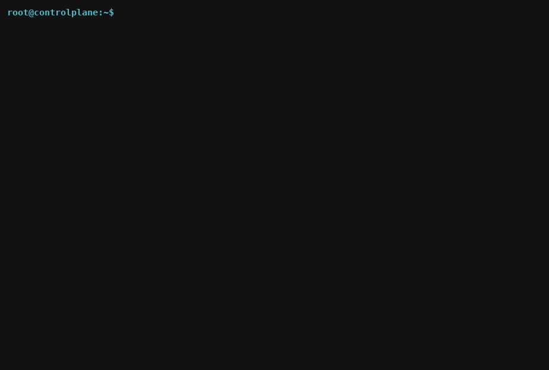

<div align="center">

# cka-practice

**Eleven mock CKA exams you solve against a real cluster.
The grader inspects the cluster, not your answers.**

[](https://github.com/alvarodiez20/cka-practice/actions/workflows/ci.yml)
[](CHANGELOG.md)
[](LICENSE)
[](docs/exams.md)
[](docs/exams.md)
[](https://www.cncf.io/training/certification/cka/)
[](https://killercoda.com/playgrounds/scenario/cka)

</div>

```bash
curl -sL https://raw.githubusercontent.com/alvarodiez20/cka-practice/main/bootstrap.sh | bash
source ~/cka-practice/activate.sh
```

Run that on a [Killercoda CKA playground](https://killercoda.com/playgrounds/scenario/cka)
and you have eleven graded exams a minute later.

<div align="center">

<!-- Rendered from demo/cka-practice-kustomize.cast with demo/cast-to-gif.py.
     The terminal output is a real run of exam 11 against a live API server;
     re-record with demo/record-demo.sh whenever the verbs change. -->


</div>

---

## The idea

Every task is something you **do** to a live cluster. When you ask for a
score, the grader reads the cluster's real state — release revisions, stored
value types, rendered manifests, endpoint addresses, certificate dates — and
never compares your answer against a stored one.

That distinction matters more than it sounds:

- `--set image.tag=1.25` and `--set-string image.tag=1.25` render
  identical-looking YAML and score differently, because one stores a number.
- A NetworkPolicy with two `from` elements instead of one applies cleanly,
  allows far more traffic than intended, and scores zero.
- A Kustomize `images:` transformer keyed on the container name instead of the
  image name changes nothing, warns about nothing, and scores zero.

Guessing does not work here. Every task also carries an `explain` walkthrough:
what to inspect first, what each flag actually does, how to verify, and the
specific mistake that usually costs the points.

---

## The loop

Five commands. That is the whole interface.

```bash
cka                    # the dashboard: every exam, grouped by CKA domain
cka use netpol         # pick one — it is built in the cluster if it is not there
next                   # the first task you have not solved
grade                  # score out of 100. 66 passes, as on the real exam
explain 4              # why that did not work
```

<details>
<summary><b>What <code>cka</code> prints</b></summary>

```
  cka-practice v2.0.0 — 11 exams, 100 points each, pass mark 66
  grouped by CKA domain, heaviest first

  30%  Troubleshooting
     5  nodes         Worker node failures: kubelet, taints, static pods   not seeded
     6  tshoot        General troubleshooting: control plane, pods, RBAC   not seeded

  25%  Cluster architecture, installation and configuration
  ▸  1  helm-core     Helm: install, rollback, values, packaging               74/100
     2  helm-values   Helm: repos, values files, --atomic, subcharts            0/100
     3  helm-oci      Helm: real charts, CRDs, OCI registries              not seeded
     8  cluster       etcd backup and restore, kubeadm, certificates       not seeded
    11  kustomize     Kustomize: overlays, patches, generators, apply -k   not seeded

  20%  Services and networking
     4  netpol        NetworkPolicy and network troubleshooting            not seeded
    10  gateway       Ingress, Gateway API, and CNI troubleshooting        not seeded

  15%  Workloads and scheduling
     9  workloads     Workloads and scheduling: rollouts, Jobs, affinity   not seeded

  10%  Storage
     7  storage       Storage: PV, PVC, StorageClass, StatefulSet volumes  not seeded

  selected: helm-core  (Helm: install, rollback, values, packaging)
```

The numbers are the order the exams were written in. The **grouping** is the
CKA curriculum, heaviest domain first, which is the order worth revising in.

</details>

---

## The exams

Eleven exams, thirteen tasks each, 100 points apiece. Independent — all
eleven can be seeded on one cluster at once.

| Domain | % | Exams |
|---|---|---|
| Troubleshooting | 30 | `nodes` · `tshoot` |
| Cluster architecture | 25 | `helm-core` · `helm-values` · `helm-oci` · `kustomize` · `cluster` |
| Services & networking | 20 | `netpol` · `gateway` |
| Workloads & scheduling | 15 | `workloads` |
| Storage | 10 | `storage` |

**[→ Every exam, task by task](docs/exams.md)** — all 143 tasks with their
points, the traps, and the dependencies between them.

> **Three exams break your cluster on purpose.** `nodes` stops a worker's
> kubelet, `tshoot` takes `kube-scheduler` down, `gateway` disables a worker's
> CNI. All three back up every file they touch and all three have a restore
> command — but do not point them at a cluster you care about.

---

## Requirements

- a real cluster and `kubectl` that can reach it (Killercoda, kind, minikube, k3s)
- `bash` 3.2 or newer, and `python3`
- Helm 3.10+ for the Helm exams — installed for you if it is missing
- two nodes and passwordless `ssh` for `nodes` and `gateway`; `cluster` must
  run on the control plane
- internet access for `helm-oci`, and once for `gateway`

Everything else works offline.
[Full requirements →](docs/internals.md#requirements)

---

## Documentation

| | |
|---|---|
| [**Using it**](docs/usage.md) | every command, seeding, working across exams |
| [**The exams**](docs/exams.md) | all 143 tasks, the traps, task ordering |
| [**How it works**](docs/internals.md) | what each seed builds, and why |
| [**Troubleshooting**](docs/troubleshooting.md) | when something goes wrong |
| [**Development**](docs/development.md) | versioning, releases, what CI checks |
| [**Contributing**](CONTRIBUTING.md) | adding an exam or a task |
| [**Security**](SECURITY.md) | what this does to a machine, and what it does not |

---

## Scoring

100 points per exam; **66 passes**, the real CKA mark. There is no partial
credit within a task — it satisfies every condition or it scores zero, which is
how the exam's own automated checks behave.

```
  SCORE: 74/100  (74%)   PASS
```

`list` marks the tasks that already pass, so you can leave and come back.
Grading is idempotent and reads live state, so it is always current.

---

## Layout

```
bootstrap.sh     one-line install
activate.sh      defines the commands in your shell
cka.sh           the dispatcher: one entry point for every exam
exams/           examN.sh (tasks + grader) and setupN.sh (the seed), per exam
scripts/         release, and the CI checks worth running by hand
docs/            everything this README links to
demo/            the terminal recorder
```

---

## License

[MIT](LICENSE) — use it, fork it, add your own tasks.

<div align="center">
<sub>Not affiliated with the CNCF or the Linux Foundation. Good luck with the exam.</sub>
</div>
